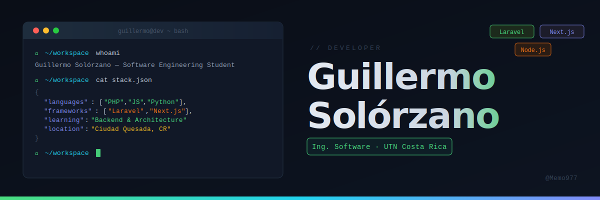

<div align="center">



</div>

---

## 🧑‍💻 Sobre mí

Soy un desarrollador web en formación, apasionado por aprender y construir soluciones tecnológicas. Actualmente curso el **Bachillerato en Ingeniería del Software** en la UTN, y cuento con el **Diplomado en Tecnologías Informáticas** ya concluido (agosto 2025).

Me caracterizo por ser responsable, proactivo y con facilidad para aprender de forma autónoma. Aunque aún estoy desarrollando mi experiencia en programación, tengo una base sólida en tecnologías web y disfruto cada proyecto como una oportunidad de crecimiento.

- 🎓 Bachillerato en Ingeniería del Software (en curso) — UTN
- 🏅 Diplomado en Tecnologías Informáticas — UTN (2025)
- 🛠️ Técnico Medio en Informática en Soporte Técnico — COTAI (2016)
- 🤝 Abierto a colaborar en proyectos de práctica y aprendizaje

---

## 🚀 Actualmente

```text
📚 Estudiando    Bachillerato en Ingeniería del Software (UTN)
🌱 Aprendiendo   Arquitectura de software y desarrollo backend
🔨 Practicando   Laravel, Next.js y bases de datos relacionales
🎯 Buscando      Mi primera oportunidad formal como desarrollador
```

---

## 🎯 Objetivos profesionales

Quiero consolidarme como desarrollador fullstack, combinando la experiencia en atención al cliente y trabajo en equipo que ya tengo, con las habilidades técnicas que estoy desarrollando. Mi meta es contribuir a proyectos reales donde pueda seguir creciendo mientras aporto valor desde el primer día.

---

## 🛠️ Tecnologías y herramientas

### Lenguajes


### Frameworks y librerías


### Bases de datos


### Herramientas


---

## 💼 Experiencia relevante

| Empresa | Rol | Período |
|---|---|---|
| Extreme Tech San Carlos | Apoyo en ventas y atención al cliente | Nov 2025 – Ene 2026 |
| Mundotec S.A. | Encargado de servicio al cliente y mantenimiento técnico | Oct 2016 – May 2017 |
| Coopelesca | Asistente de mantenimiento de equipo técnico | Nov 2015 – Ene 2016 |

---

## 🌐 Idiomas

| Idioma | Nivel | Detalles |
|---|---|---|
| 🇨🇷 Español | Nativo | — |
| 🇺🇸 Inglés | Intermedio (B1–B2) | Lectura técnica B1 · Escucha B2 · Producción oral B1 |

---

## 💡 Dato curioso

Empecé en tecnología reparando computadoras en el colegio técnico, y hoy estoy construyendo aplicaciones web. Eso me da una perspectiva diferente: entiendo tanto el hardware como el software, y sé cómo explicarle la tecnología a personas no técnicas, algo que no todos los desarrolladores tienen.

---

<div align="center">

*"Cada proyecto es una oportunidad de aprender algo nuevo."*

⭐ ¡Si algún repositorio te resulta útil, considera dejarle una estrella!

</div>
